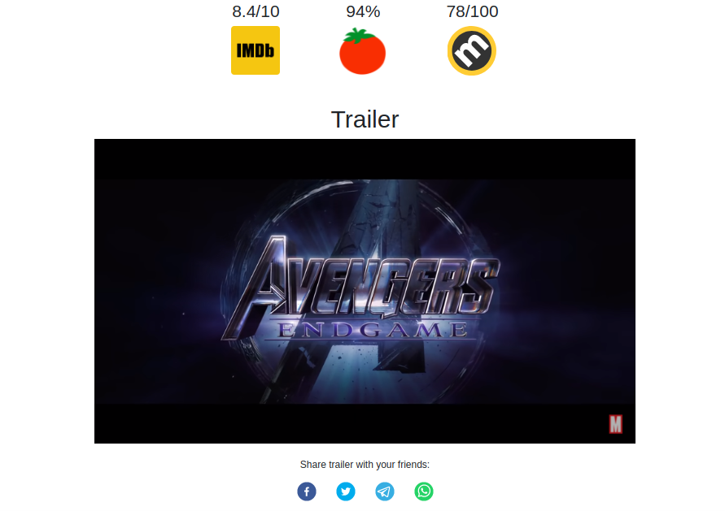

<p align="center"><a href="https://kinowebapp.herokuapp.com/" target="_blank"></a></p>

# About Kino 
On Kino users can easily find information on the movies they love! The project won 1st place (with a prize of 500€) at the [Dept back-end case assignment](https://www.deptagency.com/case-backend-developers/) which was part of the [2021 Digital Talent Virtual Fair](https://digitaltalent.easyvirtualfair.com/) at the University of Porto.

## Features
- Search by movie title
- Highlight of movie information such as release date, awards, box office, trailer, and much more
- Ratings by IMDB, Rotten Tomatoes and Metacritic
- Users can share movie trailers on social media
- Authentication system which allows creation of list of favorite movies for quick look up




## Usage
If you would like to run the application locally, first clone the repository

```
git clone https://github.com/w3slley/kino.git
cd kino
```
In one terminal run the Node.js server

```
node index.js
```

and in another run the React development server

```
cd frontend
npm start
```

Wait for the browser to open at `http://localhost:3000`.

## Tech stack
The web application was developed using Node.js and MongoDB on the back-end and React.js on the front end. The deployment was made on Heroku.

The [OMDB](https://www.omdbapi.com/) API was used to retreive all the movie information and the YouTube API was used to get the trailer for each movie.

The authentication system was implemented on the browser using `LocalStorage`.

## Back-end movies API

### `/movies/search/` (GET)
Retrieves list of movies that contains search term `movieTitle`

#### GET Parameters
`q`: Search term (`+` instead of spaces between words)

`p`: Page number (1 is the default value)

Example:

`curl 'https://kinowebapp.herokuapp.com/movies/search?q=iron+man&p=1'`

```
{
  "Search": [
    {
      "Title": "Iron Man",
      "Year": "2008",
      "imdbID": "tt0371746",
      "Type": "movie",
      "Poster": "https://m.media-amazon.com/images/M/MV5BMTczNTI2ODUwOF5BMl5BanBnXkFtZTcwMTU0NTIzMw@@._V1_SX300.jpg"
    },
    {
      "Title": "Iron Man 3",
      "Year": "2013",
      "imdbID": "tt1300854",
      "Type": "movie",
      "Poster": "https://m.media-amazon.com/images/M/MV5BMjE5MzcyNjk1M15BMl5BanBnXkFtZTcwMjQ4MjcxOQ@@._V1_SX300.jpg"
    },
    {
      "Title": "Iron Man 2",
      "Year": "2010",
      "imdbID": "tt1228705",
      "Type": "movie",
      "Poster": "https://m.media-amazon.com/images/M/MV5BMTM0MDgwNjMyMl5BMl5BanBnXkFtZTcwNTg3NzAzMw@@._V1_SX300.jpg"
    }
  ],
  "totalResults": "74",
  "Response": "True"
}
```

### `/movies/:imdbId` (GET)
Retrieves data on movie whose IMDB id is `imdbId`. 

Example:

`curl 'https://kinowebapp.herokuapp.com/movies/tt0111161'`

```
{
  "Title": "The Shawshank Redemption",
  "Year": "1994",
  "Rated": "R",
  "Released": "14 Oct 1994",
  "Runtime": "142 min",
  "Genre": "Drama",
  "Director": "Frank Darabont",
  "Writer": "Stephen King, Frank Darabont",
  "Actors": "Tim Robbins, Morgan Freeman, Bob Gunton",
  "Plot": "Two imprisoned men bond over a number of years, finding solace and eventual redemption through acts of common decency.",
  "Language": "English",
  "Country": "United States",
  "Awards": "Nominated for 7 Oscars. 21 wins & 43 nominations total",
  "Poster": "https://m.media-amazon.com/images/M/MV5BMDFkYTc0MGEtZmNhMC00ZDIzLWFmNTEtODM1ZmRlYWMwMWFmXkEyXkFqcGdeQXVyMTMxODk2OTU@._V1_SX300.jpg",
  "Ratings": [
    {
      "Source": "Internet Movie Database",
      "Value": "9.3/10"
    },
    {
      "Source": "Rotten Tomatoes",
      "Value": "91%"
    },
    {
      "Source": "Metacritic",
      "Value": "80/100"
    }
  ],
  "Metascore": "80",
  "imdbRating": "9.3",
  "imdbVotes": "2,414,547",
  "imdbID": "tt0111161",
  "Type": "movie",
  "DVD": "15 Aug 2008",
  "BoxOffice": "$28,699,976",
  "Production": "Columbia Pictures, Castle Rock Entertainment",
  "Website": "N/A",
  "Response": "True",
  "YoutubeId": "NmzuHjWmXOc"
}
```

It's worth poiting out that the field `YoutubeId` on the previous response corresponds to a video unique identifier which is used to render the YouTube video on a movie page (the url of a video is `https://youtube.com/watch?v=:YoutubeId`). And this data field doesn't come from OMDB itself: it is retreived from the YouTube API and then appended to the response body. 

Therefore, to minimize calls both to the back-end API and also to the public APIs used, a decision was made to make one call to `/movies/search` to get a list of movies related to the users' search term and another call to `/movies/:imdbId` to display the movie information on its unique page.

